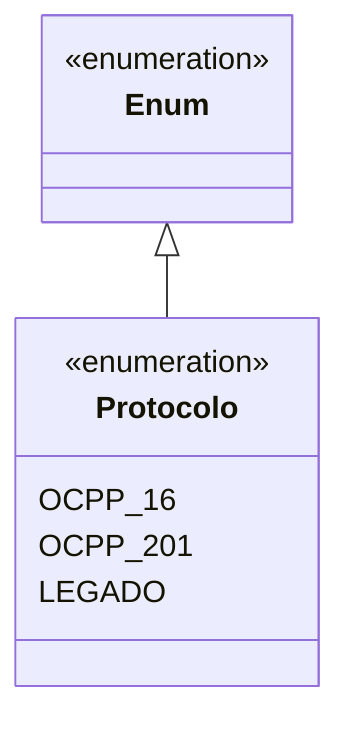
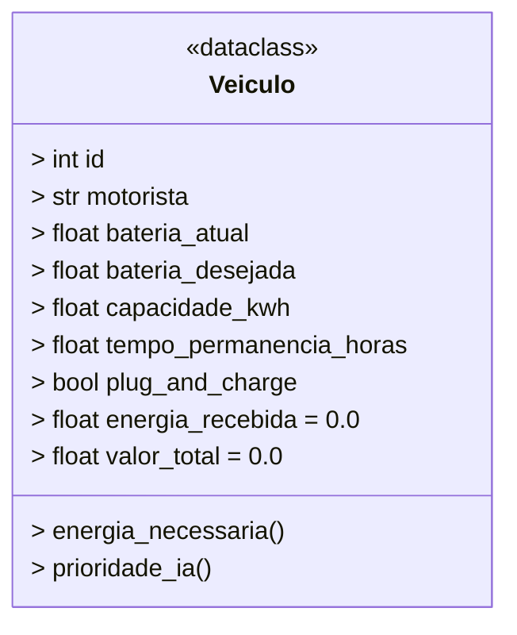
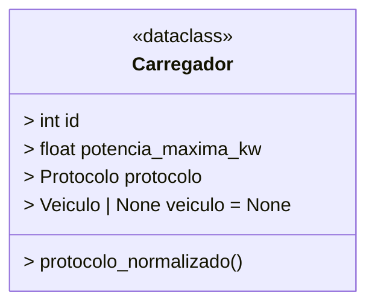
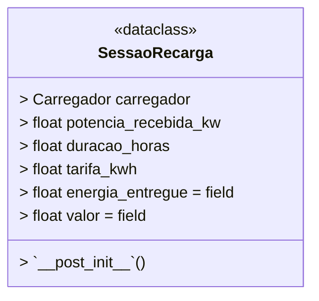
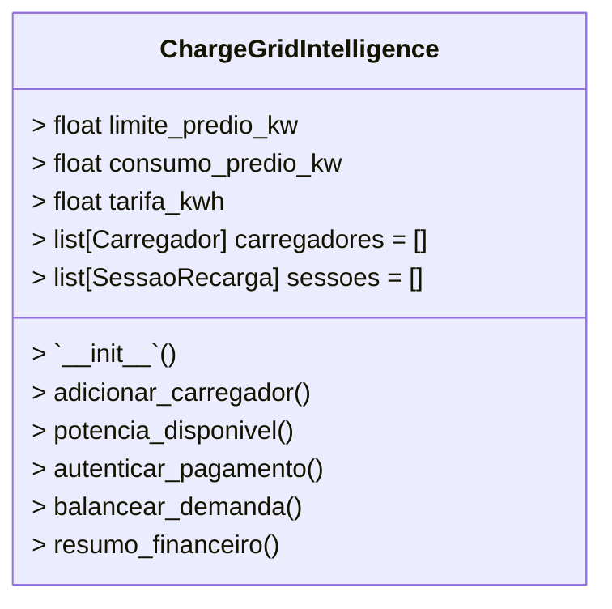
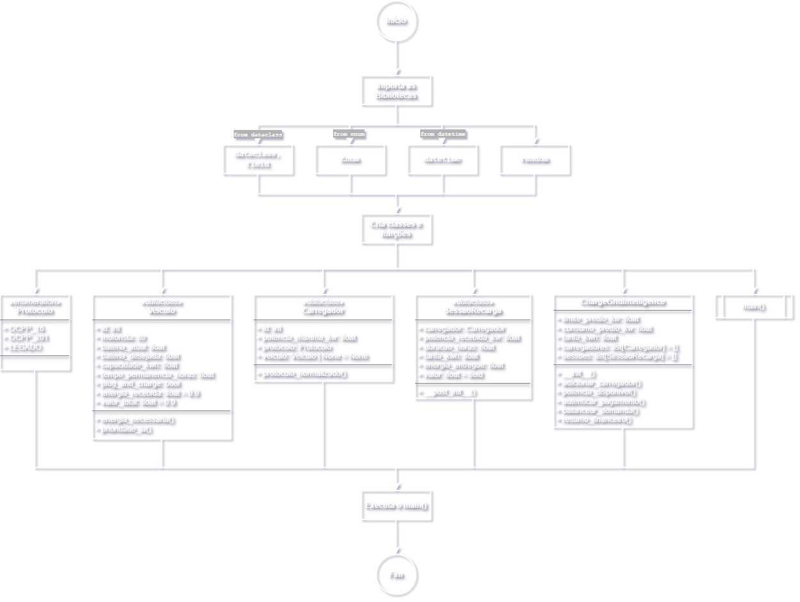

# ChargeGrid Intelligence — Sprint 2 GoodWe Challenge

## Integrantes

* Arthur de Oliveira — RM: 568986
* Miguel Piedade — RM: 572445
* Rafael Zani — RM: 569033

---

## Objetivo Geral do Challenge

O objetivo geral do challenge é propor e implementar uma solução relacionada ao sistema de recarga inteligente da GoodWe no meio comercial, considerando ambientes como estacionamentos, prédios corporativos, shoppings, condomínios comerciais e empresas com múltiplas estações de carregamento para veículos elétricos.

A proposta busca demonstrar como a infraestrutura da GoodWe pode ser aplicada em um cenário B2B, no qual existem desafios maiores do que no ambiente residencial, como:

* múltiplos carregadores operando ao mesmo tempo;
* risco de sobrecarga elétrica;
* necessidade de cobrança dos usuários;
* integração entre equipamentos de diferentes fabricantes;
* uso de inteligência artificial para otimizar a distribuição de energia.

---

## Objetivo do Projeto

Este projeto tem como objetivo desenvolver uma prova de conceito funcional em Python para simular o funcionamento de uma solução chamada **ChargeGrid Intelligence**.

A simulação demonstra como um sistema inteligente poderia:

* monitorar o limite energético de um prédio comercial;
* calcular a potência disponível para recarga;
* distribuir energia entre diferentes veículos elétricos;
* priorizar veículos com base em tempo de permanência e energia necessária;
* simular interoperabilidade entre protocolos de carregadores;
* calcular o valor cobrado pela energia consumida;
* realizar um split financeiro entre os envolvidos na operação.

---

## Contexto da Solução

Em ambientes comerciais, vários veículos elétricos podem tentar carregar ao mesmo tempo. Isso pode gerar picos de demanda e risco de ultrapassar o limite contratado de energia do prédio.

Para resolver esse problema, o sistema utiliza uma lógica de balanceamento dinâmico de carga. A potência disponível é calculada subtraindo o consumo atual do prédio do limite energético contratado.

Depois disso, o sistema distribui a energia entre os veículos conectados, considerando a prioridade de cada um.

A prioridade é calculada com base em dois fatores:

1. energia necessária para atingir a bateria desejada;
2. tempo de permanência do motorista no local.

Veículos que precisam de mais energia em menos tempo recebem maior prioridade.

---

## Tecnologias Utilizadas

* Python 3
* dataclasses
* enum
* datetime
* random

---

## Bibliotecas Importadas

O projeto utiliza algumas bibliotecas nativas do Python, ou seja, não é necessário instalar pacotes externos com `pip`.

### `dataclasses`

```python
from dataclasses import dataclass, field
```

A biblioteca **`dataclasses`** permite criar classes focadas em armazenar dados com menos código repetitivo.

No projeto, ela é usada nas classes:

- `Veiculo`
- `Carregador`
- `SessaoRecarga`

O **`@dataclass`** cria automaticamente métodos como **`__init__`**, facilitando a criação dos objetos.

O **`field(init=False)`** é usado na classe **`SessaoRecarga`** para indicar que os atributos **`energia_entregue`** e **`valor`** não serão informados manualmente na criação do objeto, pois são calculados automaticamente no método **`__post_init__`**.

---

### `enum`

```python
from enum import Enum
```

A biblioteca **`enum`** permite criar conjuntos de valores fixos e organizados.

No projeto, ela é usada na classe Protocolo, que define os tipos de protocolo dos carregadores:

- `OCPP_16`
- `OCPP_201`
- `LEGADO`

Isso evita o uso de textos soltos no código e deixa o sistema mais seguro e legível.

---

### `datetime`

```python
from datetime import datetime
```

A biblioteca **`datetime`** é usada para trabalhar com datas e horários.

No projeto, ela é utilizada para mostrar o horário em que a simulação foi executada:

```python
datetime.now().strftime("%d/%m/%Y %H:%M")
```

Isso deixa a saída do terminal mais organizada e realista, simulando um registro de operação do sistema.

---

### `random`

```python
import random
```

A biblioteca **`random`** permite gerar escolhas ou números aleatórios.

No projeto, ela é usada para simular a aprovação ou recusa de pagamento quando o veículo não possui Plug & Charge:

```python
random.choice([True, True, False])
```

Nesse caso, o sistema tem maior chance de aprovar o pagamento, mas ainda existe possibilidade de falha, representando uma situação real de cartão recusado, erro no aplicativo ou falha no QR Code.

---

## Resumo das Bibliotecas

| Biblioteca | Função no Python | Uso no Projeto |
|---|---|---|
| `dataclasses`	| Criar classes de dados com menos código | Estruturar veículos, carregadores e sessões |
| `field` | Configurar atributos especiais em dataclasses | Calcular automaticamente energia e valor |
| `enum` | Criar opções fixas e organizadas | Representar protocolos dos carregadores |
| `datetime` | Trabalhar com datas e horários | Exibir horário da simulação |
| `random` | Gerar escolhas aleatórias | Simular aprovação ou recusa de pagamento |

---

## Estrutura do Projeto

```
SP2-ARM-Python/
│
├── main.py
└── README.md
```

---

## Como Executar o Projeto

1. Instale o Python 3 em sua máquina.

2. Clone ou baixe este repositório.

3. Acesse a pasta do projeto pelo terminal.

4. Execute o arquivo principal:

```bash
python main.py
```

ou, dependendo da instalação:

```bash
python3 main.py
```

---

## Explicação Geral do Código

O código simula uma central inteligente de recarga para veículos elétricos em ambiente comercial.

A lógica principal está dividida em classes:

* `Protocolo`
* `Veiculo`
* `Carregador`
* `SessaoRecarga`
* `ChargeGridIntelligence`

Cada classe representa uma parte importante do sistema.

---

## Classe Protocolo

A classe `Protocolo` utiliza `Enum` para representar os tipos de comunicação suportados pelos carregadores.

Protocolos simulados:

* `OCPP_16`: representa carregadores com protocolo OCPP 1.6;
* `OCPP_201`: representa carregadores com protocolo OCPP 2.0.1;
* `LEGADO`: representa carregadores antigos ou com protocolo proprietário.

Essa classe ajuda a demonstrar o conceito de interoperabilidade, pois o sistema aceita carregadores de diferentes padrões.



---

## Classe Veiculo

A classe `Veiculo` representa um veículo elétrico conectado ao sistema.

Atributos principais:

* `id`: identificador do veículo;
* `motorista`: nome do motorista;
* `bateria_atual`: porcentagem atual da bateria;
* `bateria_desejada`: porcentagem desejada após a recarga;
* `capacidade_kwh`: capacidade total da bateria;
* `tempo_permanencia_horas`: tempo que o motorista ficará no local;
* `plug_and_charge`: indica se o veículo possui autenticação automática;
* `energia_recebida`: energia acumulada durante a recarga;
* `valor_total`: valor total cobrado do motorista.

### Método energia_necessaria

O método `energia_necessaria()` calcula quantos kWh o veículo precisa receber.

A fórmula utilizada é:

```python
energia = ((bateria_desejada - bateria_atual) / 100) * capacidade_kwh
```

Exemplo:

Se um carro tem bateria de 60 kWh, está com 25% e deseja chegar a 80%, a diferença é de 55%.

```python
energia = (55 / 100) * 60
energia = 33 kWh
```

Portanto, esse veículo precisa de 33 kWh.

### Método prioridade_ia

O método `prioridade_ia()` simula uma inteligência artificial simples.

Ele calcula a prioridade com a fórmula:

```python
prioridade = energia_necessaria / tempo_permanencia_horas
```

Isso significa que um carro que precisa de muita energia e ficará pouco tempo no local terá prioridade maior.



---

## Classe Carregador

A classe `Carregador` representa uma estação física de recarga.

Atributos principais:

* `id`: identificador do carregador;
* `potencia_maxima_kw`: potência máxima suportada;
* `protocolo`: protocolo utilizado pelo carregador;
* `veiculo`: veículo conectado ao carregador.

### Método protocolo_normalizado

O método `protocolo_normalizado()` simula um middleware de interoperabilidade.

Ele converte diferentes protocolos para um padrão interno baseado em OCPP 2.0.1.

Exemplos:

* carregador OCPP 2.0.1: já está no padrão;
* carregador OCPP 1.6: convertido para OCPP 2.0.1;
* carregador legado: convertido para OCPP 2.0.1.

Essa parte representa a capacidade do sistema de integrar carregadores diferentes em uma única plataforma.



---

## Classe SessaoRecarga

A classe `SessaoRecarga` representa uma sessão individual de carregamento.

Atributos principais:

* `carregador`: carregador utilizado;
* `potencia_recebida_kw`: potência liberada para o veículo;
* `duracao_horas`: duração da sessão;
* `tarifa_kwh`: preço cobrado por kWh;
* `energia_entregue`: energia total entregue na sessão;
* `valor`: valor total cobrado.

### Método **`__post_init__`**

O método `__post_init__()` é executado automaticamente depois da criação da sessão.

Ele calcula:

```python
energia_entregue = potencia_recebida_kw * duracao_horas
```

e também:

```python
valor = energia_entregue * tarifa_kwh
```

Assim, cada sessão já calcula automaticamente a energia consumida e o preço final.



---

## Classe ChargeGridIntelligence

A classe `ChargeGridIntelligence` é a classe principal do projeto.

Ela representa o sistema inteligente da GoodWe responsável por gerenciar todas as recargas.

Atributos principais:

* `limite_predio_kw`: limite contratado de energia do prédio;
* `consumo_predio_kw`: consumo atual do prédio;
* `tarifa_kwh`: valor cobrado por kWh;
* `carregadores`: lista de carregadores cadastrados;
* `sessoes`: lista de sessões realizadas.

### Método adicionar_carregador

O método `adicionar_carregador()` adiciona um novo carregador ao sistema.

Ele recebe um objeto da classe `Carregador` e o coloca dentro da lista de carregadores.

### Método potencia_disponivel

O método `potencia_disponivel()` calcula quanto ainda pode ser usado para recarga.

A fórmula utilizada é:

```python
potencia_disponivel = limite_predio_kw - consumo_predio_kw
```

Caso o resultado seja negativo, o sistema retorna zero para evitar sobrecarga.

### Método autenticar_pagamento

O método `autenticar_pagamento()` simula a validação de pagamento.

Se o veículo possuir Plug & Charge, o pagamento é aprovado automaticamente.

Caso contrário, o sistema simula uma tentativa de pagamento manual, como cartão, aplicativo ou QR Code.

### Método balancear_demanda

O método `balancear_demanda()` é a parte mais importante do projeto.

Ele executa a lógica de gerenciamento inteligente de demanda.

Passos executados:

1. verifica quais carregadores possuem veículos conectados;
2. calcula a potência disponível no prédio;
3. bloqueia a recarga caso não exista potência disponível;
4. ordena os veículos pela prioridade calculada;
5. distribui a potência proporcionalmente;
6. respeita o limite máximo de cada carregador;
7. cria uma sessão de recarga;
8. calcula energia entregue;
9. calcula valor cobrado;
10. exibe os dados da operação no terminal.

Esse método representa o controle inteligente de recarga, evitando que o prédio ultrapasse sua capacidade energética.

### Método resumo_financeiro

O método `resumo_financeiro()` apresenta o resultado financeiro da operação.

Ele calcula:

* total de energia vendida;
* faturamento total;
* divisão do valor entre os envolvidos.

O split utilizado na simulação é:

* 70% para o dono do estacionamento;
* 20% para a GoodWe/software;
* 10% para manutenção/infraestrutura.



---

## Função main

A função `main()` é o ponto de entrada do programa.

Ela realiza os seguintes passos:

1. cria o sistema ChargeGrid Intelligence;
2. cria veículos simulados;
3. cria carregadores simulados;
4. conecta veículos aos carregadores;
5. executa o balanceamento de demanda;
6. exibe o resumo financeiro.

No final do arquivo, a linha:

```python
main()
```

Executa o código completo.

---

## Exemplo de Saída Esperada

```txt
===== CHARGEGRID INTELLIGENCE =====
Horário da simulação: 11/06/2026 22:30
Limite contratado do prédio: 120.0 kW
Consumo atual do prédio: 82.0 kW
Potência disponível para recarga: 38.0 kW

===== SESSÕES DE RECARGA =====

Carregador 103
Motorista: Carla
Protocolo original: Protocolo Legado
Interoperabilidade: Convertido de protocolo legado para OCPP 2.0.1
Plug & Charge: Sim
Prioridade IA: 18.33
Potência liberada: 18.20 kW
Energia entregue: 18.20 kWh
Valor cobrado: R$ 38.22
```

---


## Fluxograma

<p align="center">
    
</p>

---

## Relação com os Pilares do ChargeGrid

### 1. Gerenciamento Inteligente de Demanda

O sistema calcula a potência disponível e distribui energia sem ultrapassar o limite do prédio.

### 2. Tarifação e Pagamento

Cada sessão calcula automaticamente a energia entregue e o valor cobrado.

### 3. Interoperabilidade

O sistema aceita carregadores com diferentes protocolos e simula a conversão para um padrão interno.

### 4. Inteligência Artificial

A prioridade de recarga é calculada com base em energia necessária e tempo disponível.

---

## Conclusão

O projeto ChargeGrid Intelligence da Sprint 2 apresenta uma prova de conceito funcional para demonstrar como a GoodWe poderia aplicar seu sistema de recarga inteligente em ambientes comerciais.

A simulação mostra, de forma prática, como controlar demanda, calcular tarifas, integrar carregadores diferentes e usar uma lógica inteligente para priorizar veículos elétricos.